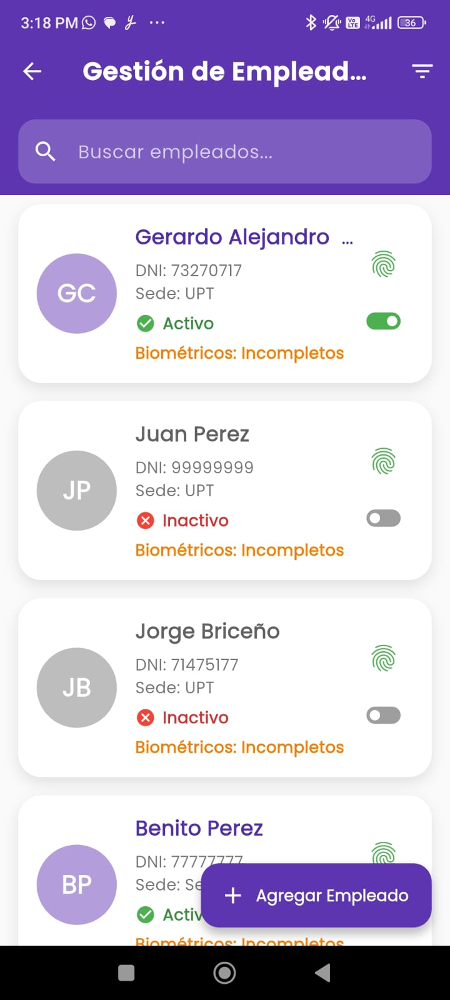
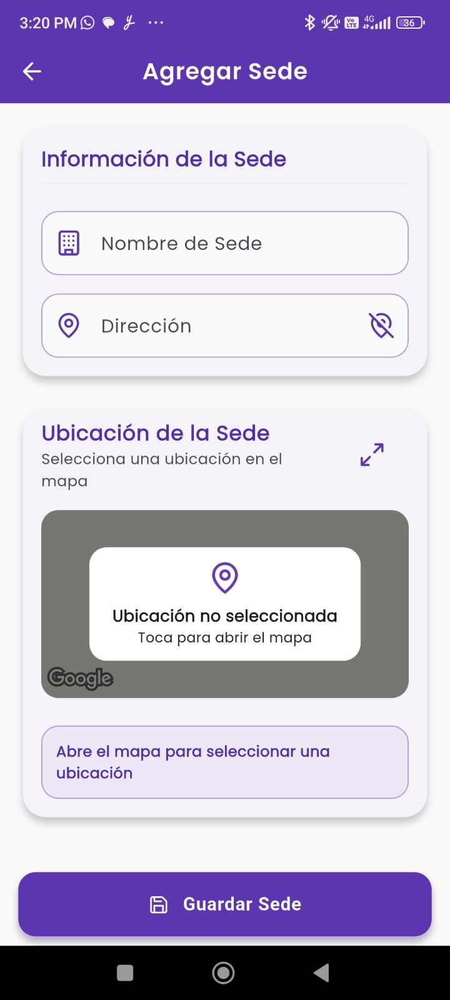
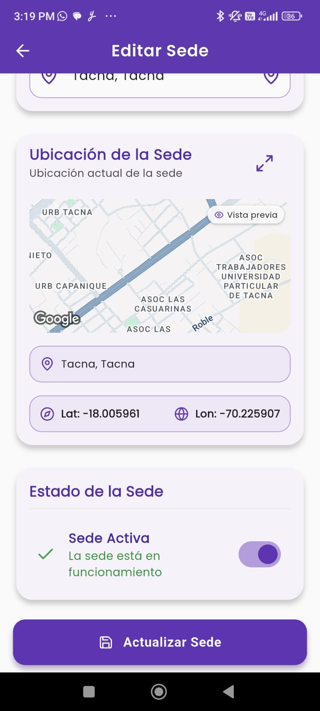

# Sistema de Control de Asistencia Móvil

Este proyecto corresponde al examen práctico de la Unidad II y tiene como finalidad facilitar la gestión de empleados y sedes para un control de asistencia eficiente y confiable.

La aplicación está pensada para que los administradores puedan mantener actualizados los estados de los empleados y las sedes, mientras que los empleados puedan registrar su asistencia en las ubicaciones correspondientes.

---

## ✅ Funcionalidades Principales

### 1. Activación y Desactivación de Empleados

**Historia de Usuario:**  
*Como administrador, quiero activar o desactivar empleados según su estado laboral, para mantener actualizado el registro de empleados activos y evitar registros de asistencia inválidos.*

**Características:**
- Botón para activar o desactivar el estado laboral del empleado.
- Actualización en tiempo real con reflejo visual inmediato.
- Sincronización con el backend para persistencia del estado.

**Captura:**

---

### 2. Gestión de Sedes

**Historia de Usuario:**  
*Como administrador, quiero registrar y gestionar sedes con su nombre, dirección y coordenadas GPS, para definir con precisión las ubicaciones donde los empleados pueden registrar su asistencia.*

**Características:**
- Formulario para registrar sedes con nombre, dirección y coordenadas GPS.
- Mapa interactivo para marcar la ubicación exacta.
- Validación de los datos antes del registro.
- Almacenamiento seguro en la base de datos.

**Capturas:**

Formulario de registro y mapa:

  

---

## 🔧 Tecnologías Utilizadas

- **Framework:** Flutter (desarrollo multiplataforma)
- **IDE:** Visual Studio Code
- **Base de Datos:** Firebase Firestore
- **Paquetes y Plugins:**  
  - `google_maps_flutter`  
  - `geolocator`  
  - `geocoding`  
  - `cloud_firestore`  
  - `lucide_icons`
- **Control de Versiones:** Git y GitHub
- **Despliegue:** Testing en navegador Chrome en modo debug

---

## 🔗 Enlaces

- [Repositorio GitHub](https://github.com/AC2021069830/SM2_EXAMEN_PRACTICO.git)

---

